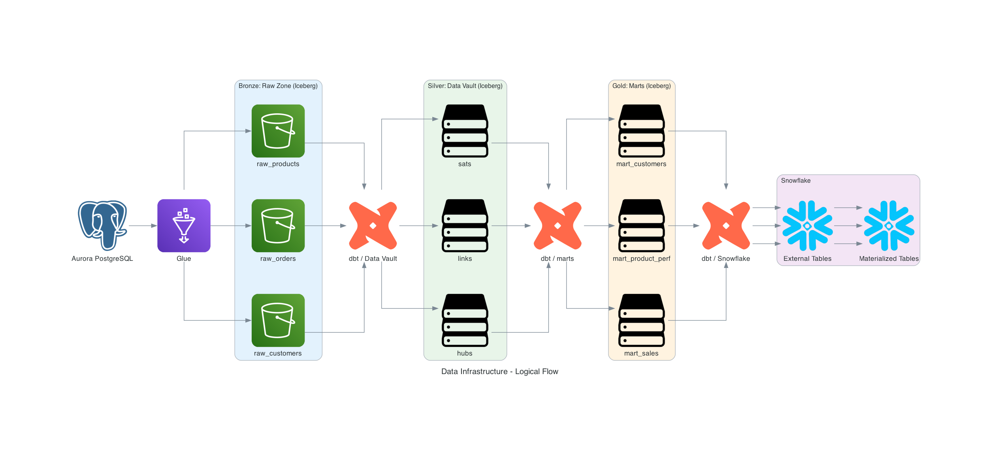
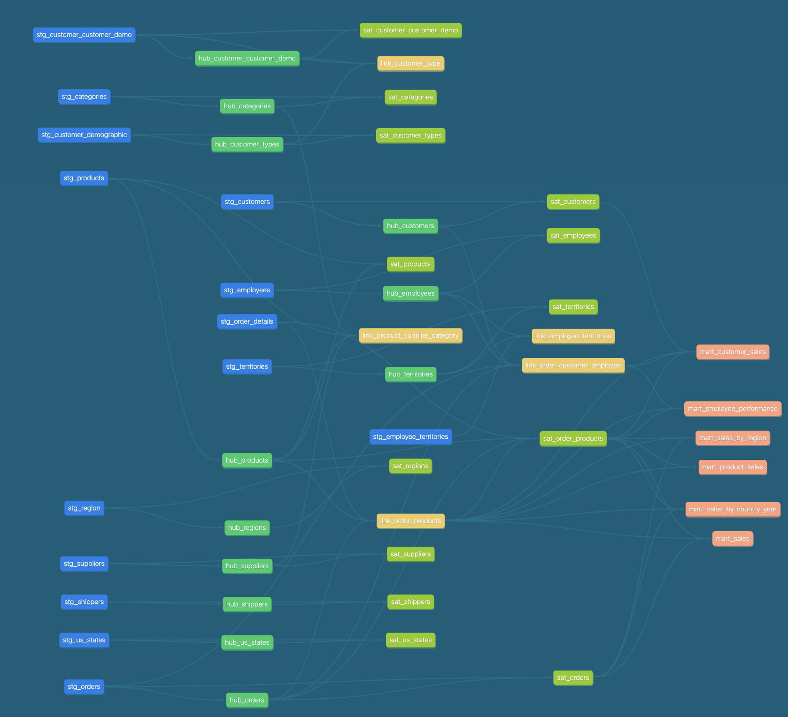

# Data Vault Analytics Platform with AWS Glue, Iceberg, and dbt
## Purpose of the Project

This project builds a modern, scalable data warehouse architecture using:
- AWS Aurora Serverless for transactional data storage as the source system
- AWS Glue & Iceberg for robust, ACID-compliant data lake storage
- dbt for implementing Data Vault 2.0 modeling
- Snowflake for data warehousing and analytics
- Amazon Athena as the query engine
- Terraform for infrastructure provisioning

The goal is to demonstrate how to build a production-grade, cloud-native analytical platform for batch data processing
and historical tracking using open standards and managed AWS services.

---
## Architecture Overview


---
## 🔧 Infrastructure Setup and Tools

### 📦 Tools You’ll Need

Make sure you have the following installed:

- [Python 3.13](https://www.python.org/downloads/)
- [uv](https://docs.astral.sh/uv/) - a Python package manager
- [AWS CLI](https://docs.aws.amazon.com/cli/latest/userguide/install-cliv2.html)
- [**tenv**](https://github.com/tofuutils/tenv) – A CLI tool to easily install and manage versions of:
  - [**OpenTofu**](https://opentofu.org/) – a community-driven, open-source alternative to Terraform (**recommended** ✅)
  - [**Terraform**](https://developer.hashicorp.com/terraform) – legacy option still widely used
  - [**Terragrunt**](https://terragrunt.gruntwork.io/) – a thin wrapper for managing Terraform/OpenTofu configurations
- [dbt CLI](https://docs.getdbt.com/) - this will be installed via `uv` in one of the next steps
- A working AWS account with sufficient permissions (IAM, VPC, Glue, RDS, etc.)
- A working Snowflake account (for data warehousing)

🧭 **Region:** This project is configured for the `eu-central-1` region by default.
🏗️ **Environment:** All Terraform modules are structured per environment (e.g., `dev`, `prod`), and the working example uses `dev`.

---

### 🛠️ Infrastructure Overview

This project provisions the following infrastructure using Terraform + Terragrunt:

#### AWS
- **VPC with Public & Private Subnets**
  - Provides network isolation and control over traffic routing.

- **NAT Gateway + VPC Endpoints**
  - Ensures secure, private connectivity to AWS services (Glue, S3, Secrets Manager, etc.) from private subnets.

- **Aurora PostgreSQL Cluster**
  - Acts as the operational source database for ingestion.

- **S3 Buckets**
  - Iceberg table storage
  - Athena query results
  - Glue ETL scripts

- **AWS Glue Jobs**
  - Responsible for transforming and exporting data from Aurora to Iceberg tables.
  - Glue version: `4.0`
  - Worker type: `G.1X`
  - Number of workers: `2`
  - Script stored in S3
  - Integrated with Secrets Manager and Data Catalog

- **Glue Data Catalog**
  - Configured to manage Apache Iceberg tables (partitioned, versioned, and incremental).

- **IAM Roles and Policies**
  - Fine-grained access for Glue, S3, Secrets Manager, and other services.

#### Snowflake
- **Snowflake Database**
  - Data warehouse for analytics and reporting.
- **Snowflake Warehouse**
  - Compute resources for running queries.
- **Snowflake Roles and Permissions**
  - Roles for data ingestion, transformation, and querying.

---

### 🚀 Deploying the Infrastructure

To spin up the infrastructure, use the commands from the Makefile in the root directory of the repository:
```bash

make aws-init
make aws-plan
make aws-apply

make snowflake-init
make snowflake-plan
make snowflake-apply
```

---
### 💾 State Management & Best Practices
- Terraform State:
  - Stored remotely using S3 and DynamoDB to enable team collaboration and avoid state conflicts.
  (You can customize this if you use a different backend setup.)
- Cost Control Tips:
  - Services like AWS Glue, Aurora, and NAT Gateway can be costly.
  E.g. notice that VPC Endpoints in `terraform/vpc.tf` are commented out to destroy them when not used, to save costs.
  - Use Aurora Serverless v2, minimal worker types for Glue, and enable auto-pause where possible.
  - Clean up dev/test environments when idle to avoid unexpected charges.
- Infrastructure Change Workflow:
  - Always preview changes before applying `aws-plan|snowflake-plan`.

---
## Loading Data into Aurora PostgreSQL
- This is a one-time setup to load sample data into the Aurora PostgreSQL database, therefore it is done manually directly from the AWS console:
  - Navigate to the RDS Console
  - Go to Query Editor, select the Aurora PostgreSQL instance, secret from Secrets Manager, and connect.
  - Use the SQL query from https://github.com/pthom/northwind_psql/blob/master/northwind.sql
  - Verify that the data is loaded successfully.

### 📊 Data Source: Northwind Database
- The Northwind database is a sample database used for learning SQL and data warehousing concepts.
- It contains tables for customers, orders, products, and other entities typically found in a transactional system.
- Below is a diagram of the Northwind database schema:

---
## 🔁 ETL Pipeline: Extract, Transform, Load

This project uses **AWS Glue** and **Apache Iceberg** to extract data from an **Aurora PostgreSQL** database and store it in an Iceberg-based data lake on **S3**.

### 📦 ETL Flow Summary

1. **Extract**:
   AWS Glue connects to the Aurora PostgreSQL instance using JDBC. Secrets are securely retrieved from AWS Secrets Manager.

2. **Transform**:
   Glue reads data using Spark and applies any lightweight transformations if needed.

3. **Load**:
   Data is written into Iceberg tables stored in S3, with metadata tracked in the AWS Glue Data Catalog.

---

### 🚀 Running the ETL Job

Once your infrastructure and source DB are set up, you can trigger the ETL job manually from the AWS Console, or via CLI:

```bash
aws glue start-job-run --job-name northwind-iceberg-aurora-to-s3-etl-dev
```

Remember to use the AWS CLI profile that has access to the Glue job and S3 bucket.

---
## 🧱 Data Modeling with dbt:  Data Vault 2.0 and Marts

Once raw data from Aurora is loaded into S3 Iceberg tables, **dbt** is used to transform it into a well-modeled Data Vault structure
and creates marts afterward. While `marts` are not part of the Data Vault, they are built on top of it for analytical purposes,
thus for the sake of this project, they are included in the same dbt project and included in this section.

### 📐 Data Vault Components

This project uses standard Data Vault layers:

- **Hubs** – core business entities (e.g., customers, products)
- **Links** – relationships between hubs (e.g., order items link customers and products)
- **Satellites** – descriptive attributes and historical data for hubs and links

---
### 🛠️ How It's Structured

- **`models/staging/`**: Source staging models (`stg_*`) loaded from raw Iceberg tables
- **`models/data_vault/hub_*.sql`**: Hubs with business keys and surrogate keys
- **`models/data_vault/link_*.sql`**: Links joining two or more hubs
- **`models/data_vault/sat_*.sql`**: Satellites with historical attributes and hashdiffs
- **`models/marts/`**: Data marts built on top of the vault

---
### 🧠 Data Vault Features Implemented

- **Incremental materializations** – Improve performance and reduce cost by only processing new or changed records.
- **Hashdiff tracking in satellites** – Enables Slowly Changing Dimension (SCD) Type 2 behavior by tracking historical changes.
- **Surrogate keys** – Simplify joins, enable deduplication, and enforce uniqueness across hubs, links, and satellites.

`dbt_utils.generate_surrogate_key()` is used for consistency in hash-based keys and change detection.

### 🧠️ Data Vault Features To Be Implemented
- **Partitioning in Iceberg** – For optimizing query performance and storage.

---
### 📊 Data Vault Model Diagram

---
### 🧪 Running dbt
Before running dbt, ensure you have Python dependencies installed. Use the `uv` environment to manage Python packages:
```bash
cd root_repo_directory
uv venv .venv
uv pip install -r requirements.txt # without developer packages
# OR
uv pip install -r requirements-dev.txt # with developer packages
```
Then, set up your dbt profile. Update the `./northwind_dbt/dbt/profile.yml` file with the following content:

```yaml
dbt_aws_profile:
  target: dev
  outputs:
    dev:
      type: athena
      s3_staging_dir: "{{ env_var('ATHENA_STAGING_DIR') }}"
      region_name: eu-central-1
      database: awsdatacatalog # can be any name, but must match the Glue Data Catalog database
      schema: northwind_data_vault
      work_group: primary
      profile_name: aws_iam_user_name

dbt_snowflake_profile:
  target: dev
  outputs:
    dev:
      type: snowflake
      account: "{{ env_var('SNOWFLAKE_ORGANIZATION_NAME') }}-{{ env_var('SNOWFLAKE_ACCOUNT_NAME') }}"
      user: "{{ env_var('SNOWFLAKE_USER') }}"
      role: "{{ env_var('SNOWFLAKE_ROLE') }}"
      authenticator: snowflake_jwt
      private_key_path: "{{ env_var('SNOWFLAKE_PRIVATE_KEY') }}"
      database: NORTHWIND_DB_DEV
      warehouse: NORTHWIND_WH_DEV
      schema: NORTHWIND_SCHEMA_DEV
```

Install dbt dependencies and run the models:

```bash
dbt deps        # installs dbt_utils
dbt seed        # optional, if seeds are defined
dbt run         # builds all models
dbt run --full-refresh   # full rebuild (use carefully)
dbt docs generate        # generate documentation
dbt docs serve           # view documentation
```

For the convenience of running dbt commands, you can use the Makefile in the root directory:
```bash
make aws-dbt # runs dbt on AWS Athena to build the models (data vault and marts)
make snowflake-dbt # migrates marts to Snowflake (creates external and materialized tables)
```


---
## Future Enhancements & Roadmap

## ✅ Testing & Quality Assurance

The aim is to ensure data accuracy, consistency, and reliability through the following measures:

- **dbt Tests**
  - `unique` and `not_null` tests on hub primary keys and link composite keys
  - `accepted_values` for enums (e.g. order status)
- **Hashdiff logic in Satellites**
  - Ensures only changed records are added (SCD Type 2 behavior)
- **Potential improvements**
  - Add row count checks across layers (raw → vault)
  - Validate foreign key relationships between hubs, links, and satellites

---
## ⚙️ Deployment & Automation

Currently, this project is executed manually, but it’s designed with automation-readiness in mind.

- **Manual Flow**
  - Terraform/Terragrunt for infrastructure
  - AWS Glue console for ETL
  - `dbt run` for transformations
  - `dbt docs generate` for documentation
- **Future Automation Ideas**
  - **Orchestration** via:
    - AWS CodePipeline
    - AWS ECS Fargate
  - **Triggering ETL** on schedule or based on data arrival


---
## 🌱 Future Enhancements & Roadmap

Here's what could be explored next:

- [ ] **Point-In-Time (PIT) Tables** for snapshot-style historical joins
- [ ] **Bridge Tables** for many-to-many relationships (e.g. products in orders)
- [ ] **Data Marts** built on top of the vault (star schema views)
- [ ] **Automated data loading** into Aurora via CDC or batch ingestion
